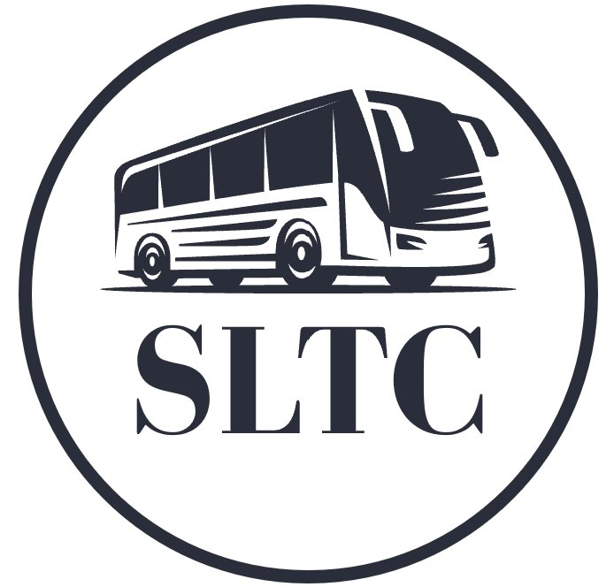

<div align="center">



# Sri Lakshmi Transport Company (SLTC)

**Smart Transportation. Seamless Operations.**

Institutional transport management platform for schools, corporates, pharma companies and universities — a trust-first marketing site plus role-based portals for admins, organizations and parents.


</div>

---

## Overview

SLTC is a Hyderabad/Telangana transport operator (incorporated 2020, ~20 years of industry
experience) serving pharma, corporate and education clients. This repository is the
**web platform** for the company:

- a **public site** built to earn trust with the people who evaluate transport vendors —
  school administrators, HR/admin and procurement teams; and
- three **role-based portals** — Super Admin (SLTC staff), Organization (a client), and
  Student/Parent — each with its own dashboard.

> **Project status.** The **frontend is complete and runnable** using local mock data. The
> backend (MongoDB + Express REST API + Razorpay) is planned and fully specified in
> [`documentation/`](documentation). See the [Roadmap](#roadmap).

---

## Features

- **Institutional landing page** — Swiss/Material layout, trust-first messaging, a bento
  grid of selling points, a dedicated safety section, fleet, real client list and a
  Request-a-Quote flow.
- **Super Admin dashboard** — KPIs, revenue/collection and occupancy charts, route revenue,
  reminders (insurance / licence / EMI / tax / fitness), fleet and organization tables.
- **Organization portal** — scoped to a single client: buses, routes, students, billing.
- **Student / Parent portal** — route, pickup, bus and driver details, distance-based fee
  calculation, and a Razorpay-style checkout (demo).
- **Light & dark mode**, responsive layout, accessible focus states and reduced-motion support.
- **Photo-ready design** — labelled slots where real vehicle/driver photos drop straight in.

---

## Tech stack

| Area | Technology |
|------|-----------|
| Framework | Next.js 15 (App Router) |
| UI | React 19, TypeScript |
| Styling | Tailwind CSS (custom navy/blue/green/amber palette) |
| Animation | Framer Motion |
| Charts | Recharts |
| Icons | lucide-react |
| Data (current) | Local mock data (`lib/mock-data.ts`) |
| Planned backend | MongoDB Atlas · Express · Node · Razorpay (REST) |
| Hosting | Vercel (+ Vercel Blob for files, planned) |

---

## Architecture

```
        Browser (admins, organizations, parents)
                        |
        +---------------+----------------+
        | Frontend (this repo) — Vercel  |
        | Next.js / React                |
        +---------------+----------------+
                        |  REST (planned)
        +---------------+----------------+
        | Express API (Node) — Vercel     |
        +----+----------------------+-----+
             |                      |
     +-------+------+       +-------+------+
     | MongoDB Atlas|       |  Razorpay    |
     +--------------+       +--------------+
```

The frontend is live today on mock data. The dotted parts (Express API, MongoDB, Razorpay)
are the next milestones — the full plan is in [`documentation/`](documentation).

---

## Getting started

### Prerequisites
- Node.js 18.18+ (tested on Node 22)

### Installation & run

```bash
# install dependencies
npm install

# start the dev server
npm run dev            # http://localhost:3000

# production build
npm run build
npm run start
```

Pages: `/` (landing), `/login` (portal selector), `/admin`, `/organization`, `/student`.

---

## Project structure

```
Sri-Lakshmi-Transport-Company/
├── app/                    # Next.js routes (landing, login, admin, organization, student)
├── components/
│   ├── landing/            # landing-page sections (hero, bento, safety, fleet, ...)
│   ├── dashboard/          # shell, charts, stat cards
│   └── ui/                 # button, logo, photo slot, theme toggle, ...
├── lib/
│   ├── mock-data.ts        # content + demo data (the API seam)
│   └── theme.tsx           # light/dark theme provider
├── public/
│   └── logo.png            # SLTC logo
├── documentation/          # project & build documentation
│   ├── SLTC-Platform-Documentation.md
│   └── SLTC-BUILD-PLAN.md
├── GIT_RULES.md            # commit & push workflow for this repo
└── README.md
```

---

## Roadmap

Current: **frontend complete (~40%)**. Full phase-by-phase plan (for the MERN backend and
deployment) lives in [`documentation/SLTC-BUILD-PLAN.md`](documentation/SLTC-BUILD-PLAN.md).

- [x] Institutional landing page
- [x] Three role-based dashboards (mock data)
- [ ] MongoDB Atlas + Express REST API
- [ ] JWT auth + role-based access
- [ ] Wire portals to live data
- [ ] Razorpay payments (test → live)
- [ ] Documents (Vercel Blob), notifications, reports
- [ ] Tests, hardening, Docker

---

## Documentation

- [Platform documentation](documentation/SLTC-Platform-Documentation.md) — stack, architecture, data model, deployment.
- [Build plan](documentation/SLTC-BUILD-PLAN.md) — phased plan from ~40% to 100%.
- [Git rules](GIT_RULES.md) — how changes are committed and pushed here.

---

## Contact

**Sri Lakshmi Transport Company** · Hyderabad & Telangana
📞 +91 81793 14684 · +91 70757 14684 · ✉️ sltc.shyam6666@gmail.com

---

## License

Released under the MIT License.
